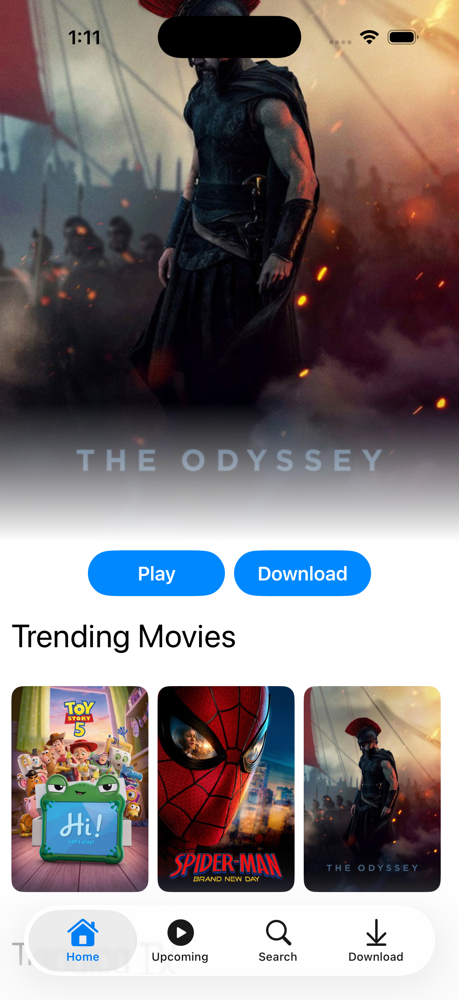
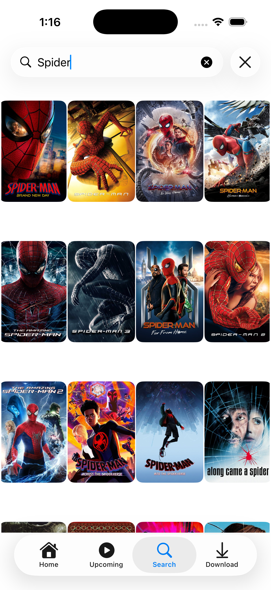
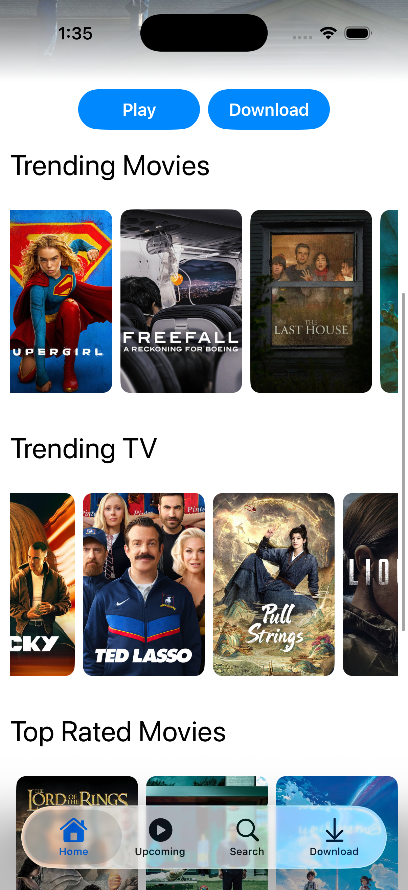
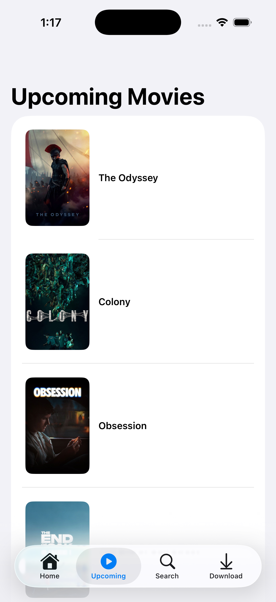
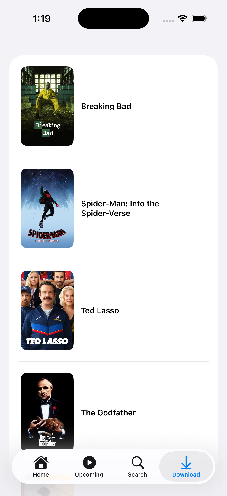

# Movie APP

A modern iOS application built with SwiftUI and MVVM architecture that allows users to discover popular movies from The Movie Database (TMDB). 

---

## 📱 Screenshots

 
  
  
  
  
  
  

---

## 🛠️ Technologies Used

* **Swift 5+** 
* **SwiftUI**
* **`@Observable`** 